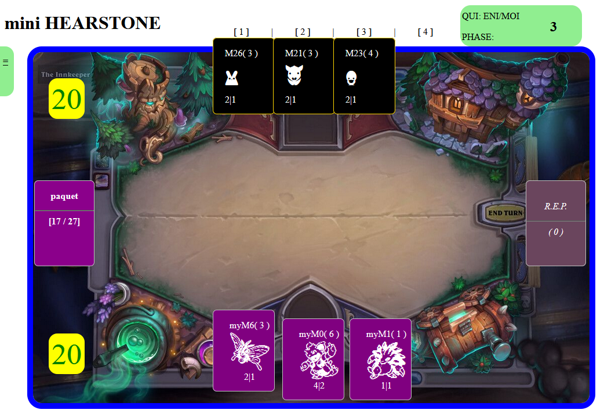

# JEU03: Baston de cartes (créatures)

Jeu de combat de cartes façon Hearstone/ MTG/ Pokémon.
Quelques libertés ont été prises avec les jeux originaux:
- au dépat du jeu, la question est posé sur la répartition des cartes (% de carte pour vous);
- une seule pioche; et un seul cimetière;
- si vous piochez une carte adverse, elle va automatiquement dans le cimetière;
- possibilité de piocher une carte dans le cimetière, même une carte adverse.

ATTENTION: la gestion de tour de jeu n'est pas encore codée!

